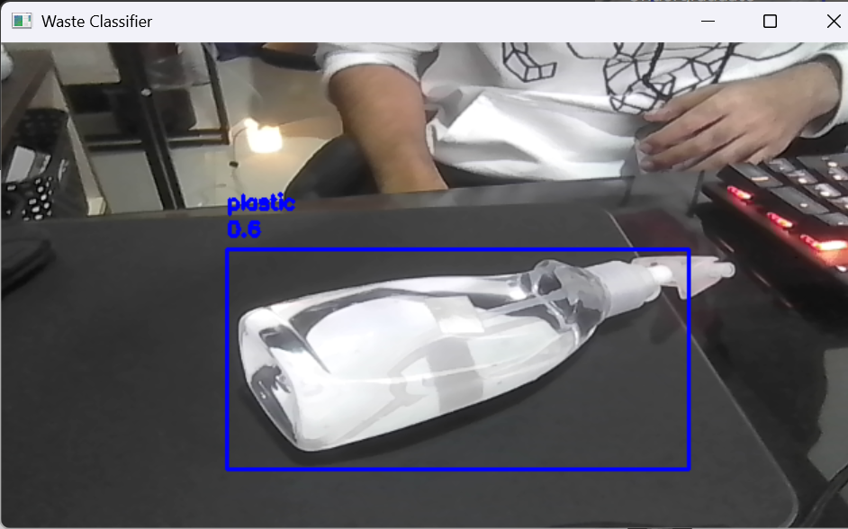
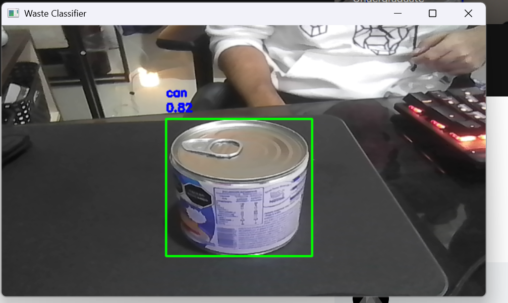

# ♻️ Garbage Classifier  

An AI-powered waste classifier built with **YOLOv8** and **OpenCV** that detects and classifies trash items through your laptop camera in real time.  
The model identifies **plastic**, **glass**, and **metal (cans)**, making it a step towards intelligent recycling systems that align with the **UN’s Sustainable Development Goals (SDG 12: Responsible Consumption and Production)**.  

---

## 🚀 Features
- Real-time object detection with your **webcam**  
- Detects and classifies waste types:
  - 🟦 Plastic  
  - 🟩 Can  
  - 🟥 Glass  
- Displays bounding boxes and confidence scores on screen  
- Lightweight Python app using YOLOv8 + OpenCV
- Model made with 95% accuracy


---

## 📸 Demo

<p align="center">
  
</p>

<p align="center">
  
</p>


---

## 🛠️ Installation  

### 1. Clone the repository  

```bash
git clone https://github.com/Vizard16/Garbage-Classifier-.git
cd Garbage-Classifier-
```
### 2. Create a virtual environment (optional but recommended)
```bash
python -m venv venv
venv\Scripts\activate   # On Windows
```
### 3. Install dependencies
```bash
pip install ultralytics opencv-python numpy
```
---
## ▶️ Usage

Place your trained YOLO weights (waste_classifier.pt) inside the project folder.

Run the app:
```bash
python test.py
```

A camera window will open.

Hold an object (plastic, can, glass,.) in front of your laptop camera

The app will draw a bounding box and print the prediction + confidence

Press q to quit

## 🌍 Why this project?

Proper waste segregation is a critical challenge. By classifying and identifying trash items automatically, this project contributes to:

Reducing human error in recycling

Enabling smart bins and robotic sorters

Supporting the UN Sustainable Development Goals

## 📌 TODO / Future Improvements

Add support for multi-class detection (plastic, glass, paper, cardboard, trash)

Integrate with Arduino / IoT devices to control physical bins

Export as a desktop or mobile app

## 🤝 Contributing

Pull requests are welcome! If you have ideas for better detection, dataset improvements, or integrations, feel free to fork this repo and submit PRs.

## Inquiries 

if you want the dataset used or the google notebook please write me a message via email of my profile
